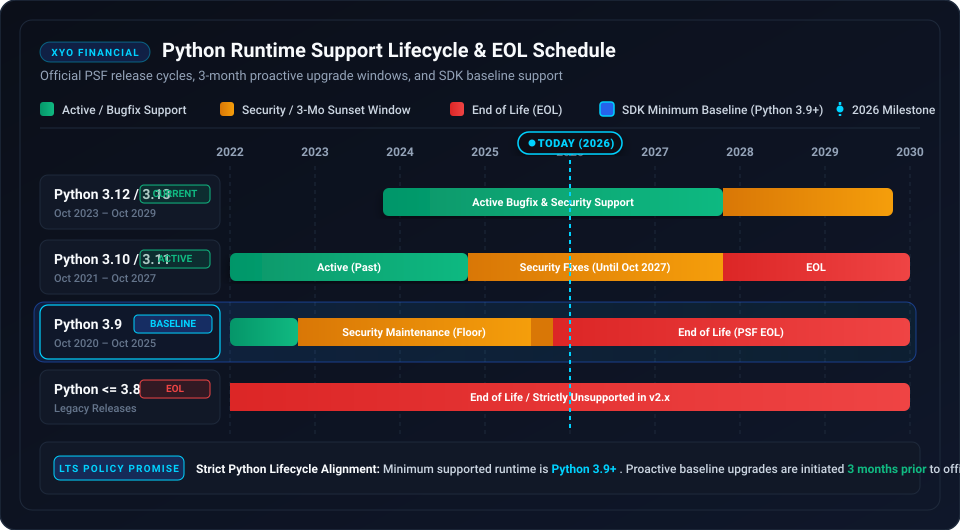

# 🛡️ Security Policy

## 📋 Supported SDK Versions

Only the `2.0.0` release of the XYO Python SDK receives active security updates and patches.

| Version | Supported | Status |
| ------- | --------- | ------ |
| 2.0.0   | :white_check_mark: | Active GA |
| < 2.0.0 | :x: | End of Life (Unsupported) |

---

## ⚙️ Runtime Lifecycle & Python LTS Support Policy

XYO Financial strictly adheres to the official Python Software Foundation (PSF) release cycle. We guarantee support for the minimum supported runtime version (currently **Python 3.9+**) and proactively update our baseline and release upgrades **3 months before** an active runtime reaches upstream End-of-Life (EOL).

### 📊 Python Runtime Lifecycle Matrix

| Python Version | Release Date | End of Support (EOL) | SDK Support Status | Recommendation & Policy |
| -------------- | ------------ | -------------------- | ------------------ | ----------------------- |
| **Python 3.13** | October 2024 | October 2029 | 🟢 Supported (Latest) | Fully tested and supported upon GA release. Target runtime for modern async architectures. |
| **Python 3.12** | October 2023 | October 2028 | 🟢 Supported (Recommended) | **Recommended runtime**. Optimized for speed, improved traceback formatting, and async performance. |
| **Python 3.11** | October 2022 | October 2027 | 🟢 Supported | Active security maintenance support. |
| **Python 3.10** | October 2021 | October 2026 | 🟢 Supported | Security fixes only. Migration to 3.12+ recommended. |
| **Python 3.9** | October 2020 | October 2025 | 🟡 Minimum Supported Baseline | **Minimum required Python interpreter**. Upgrades to Python 3.11+ recommended prior to vendor EOL. |
| **Python <= 3.8** | October 2019 | October 2024 | 🔴 Unsupported | End of Life by PSF. Incompatible with modern type hints and `httpx` async transports. |

### 🔒 Proactive Lifecycle Transition Process

1. **Continuous Compatibility Testing:** All CI/CD test pipelines validate builds across Python 3.9, 3.10, 3.11, 3.12, and 3.13.
2. **3-Month Advance Notice:** Whenever a minimum baseline Python version reaches official PSF EOL, XYO Financial will issue deprecation notices 3 months in advance and advance the SDK baseline in the subsequent major or minor release.
3. **Security Patch Delivery:** Critical security patches and CVE remediations are verified across all active Python versions within guaranteed SLAs.

---

## 🏛️ Institutional Security & Defensive Engineering

The XYO Python SDK implements strict defensive engineering controls to meet Tier-1 banking compliance:

- **Zero-Trust Egress Domain Validation (CWE-183 / SSRF):** Download links are validated against pinned domains (`api.xyo.financial`, `download.xyo.financial`, AWS S3 storage hosts) and strict HTTPS schemes before dispatching network I/O.
- **Credential Leakage Prevention:** `Authorization: Bearer` headers are automatically stripped when requests are routed to third-party or S3 storage hosts.
- **Decompression Bomb Mitigation (CWE-400):** Batch TAR archive decompression enforces hard stream ceilings (`max_archive_bytes = 100 MiB`, `max_entry_bytes = 10 MiB`, `max_tar_entries = 50,000`).
- **Path Traversal & Zip Slip Defense (CWE-22 / CWE-29):** Rejects directory traversal sequences (`..`), rooted paths, and control characters in archive entry filenames.
- **CRLF Header Injection Mitigation (CWE-113):** Validates and rejects control characters in `x-api-user` and `X-Correlation-ID` headers.
- **Credential Redaction:** API keys are excluded from `__repr__` and logging strings.

---

## 🚨 Reporting a Vulnerability

If you discover a potential security vulnerability in this SDK, please do not report it publicly through a GitHub issue. Instead, report it privately:

- **Email:** security@syniol.com
- **Response Time:** We will acknowledge receipt of your vulnerability report within 48 hours and provide a detailed response on next steps within 5 business days.

### ⏱️ Incident Response SLA

| Severity | Initial Response | Remediation SLA |
| :--- | :--- | :--- |
| **Critical** (CVSS 9.0–10.0) | < 4 Hours | < 24 Hours |
| **High** (CVSS 7.0–8.9) | < 12 Hours | < 48 Hours |
| **Medium / Low** (CVSS < 7.0) | < 24 Hours | < 5 Business Days |

### ⚓ Safe Harbor

XYO Financial supports responsible security research. We will not pursue legal action against researchers who report vulnerabilities in accordance with this policy and avoid unauthorized data access or disruption of production services.
